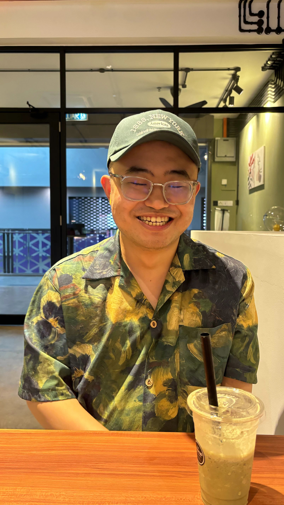

# Introduction
Hi! I'm Li Shuo, a student in the Software Maintenance and Evolution course.
I expect to learn a lot about modern software maintenance
practices and how to work with legacy systems.

- **Fun fact**: I love writing poems in Chinese.
- **Course expectations**: To gain hands-on experience in
maintaining and evolving software.

## GitHub Profile
You can view my personalized GitHub profile
[here](https://github.com/ohmyzshuo).
